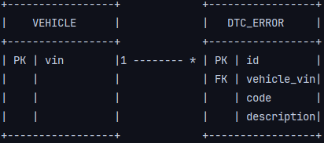

# VCI Log Parser - Autocom Report Extractor

A web application developed in **Java with Spring Boot** designed to optimize the workflow in automative repair shops.
The system automates the reading of diagnostic reports in PDF format exported by **Autocom** scanners, extracting
vehicle data and Diagnostic Trouble Codes (DTC), and stores them in a relational database.

---

## Key features
* **Direct PDF Upload:** A clean web interface that allows users to drag-and-drop or select the original `.pdf` report from the scanner (internally processed using *Apache PDFBox*).
* **Duplicate Filter:** Consolidates detected error codes by eliminating redundancies caused by different OBD-II standard mode readings (e.g., merging identical faults reported in both Mode 03 and Mode 07).
* **Automated Persistence:** Securely saves vehicles and their associated trouble codes to the database using *Spring Data JPA*.
* **User Interface:** A clean, responsive, and user-friendly dashboard built with *Thymeleaf* and *Bootstrap 5*.

---

## Tech Stack

* **Backend:** Java 17, Spring Boot 4.1.0 (Spring Web, Spring Data JPA)
* **Frontend:** Thymeleaf, HTML5, Bootstrap 5
* **PDF Processing:** Apache PDFBox 3.0.7
* **Database:** PostgreSQL 15
* **Infrastructure:** Docker & Docker Compose
* **Version Control:** Git & GitHub

---

## Data Architecture (Relational Model)

The system manages a **One-to-Many (1:N)** relationship mapped with Hibernate:




---

## How to Run the Project Locally

### Prerequisites
* Java 17 or higher installed.
* Docker and Docker Compose installed and running.

### Getting Started

1. **Clone the repository:**
   ```bash
   git clone [https://github.com/YOUR_USERNAME/vci-parser.git](https://github.com/YOUR_USERNAME/vci-parser.git)
   cd vci-parser
   ```
2. **Spin up the Database:** Ensure the docker-compose.yml file is in the root directory and run:
   ```bash
   docker compose up -d
   ```
3. **Build  and  Run the Application:** You can  run it  from your favorite IDE (like IntelliJ IDEA or via Terminal):
   ```bash
   ./mvnw spring-boot:run
   ```
4. **Acces the Web Dashboard:** Open your browser and navigate to: http://localhost:8080

### Usage Example
1. Export the diagnostic report from the Autocom scanner as a PDF file.
2. Upload the file through the application's web dashboard.
3. The system automatically extracts the VIN/Chassis, groups unique DTCs alongside their descriptions into
data table, and commits the historical record to PostgreSQL instantly.
